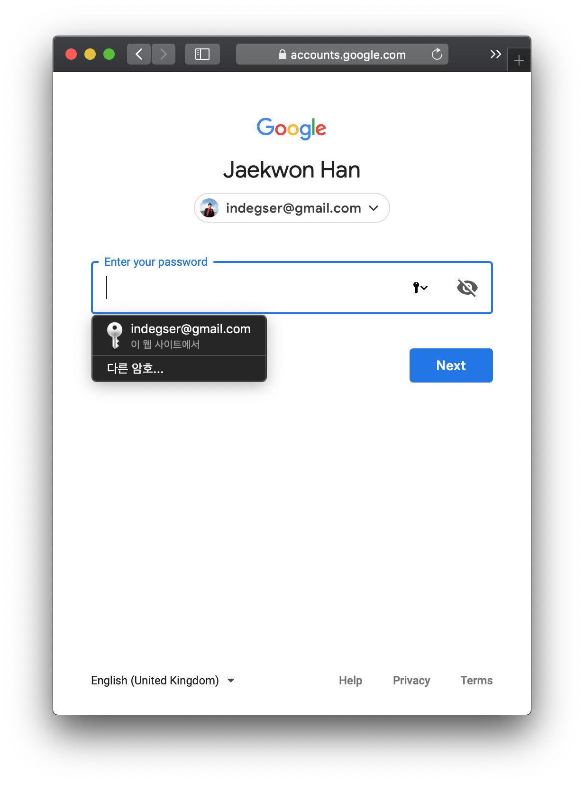
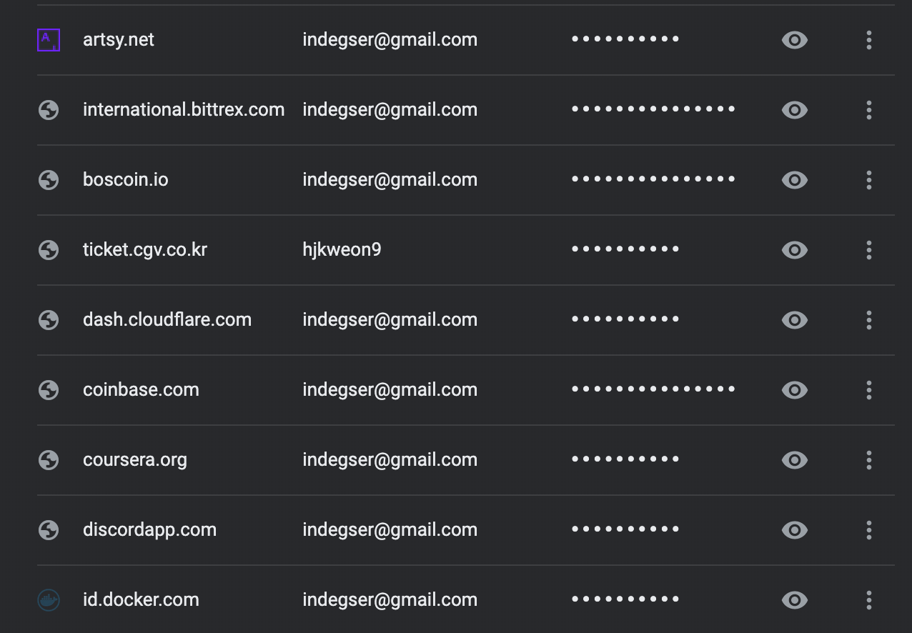

# What is Keycat

## What is it?



**Keycat** is a browser-based authenticator, supported by the **Keychain** technology.


_**Keychain**: Major browsers \(Chrome, Safari, Firefox\) and OS providers \(Apple, Google\) offer a security technology called Keychain. When you try to access a website or email account, you may have seen an pop-up option to save your password in the browser \(usually, the pop-up shows up on the top right corner of the browser.\) Here, the Keychain technology is used for storing your password \(private key\) in the browser._


In developer term, Keycat is serverless. Meaning it does not have a database nor server to save or protect user's private keys. Keycat uses browser's secure storage called "Keychain".

When you sign in to Gmail or Twitter, you might have noticed small UI saying "I have remembered your passwords on behalf of you, and if you click me, I will auto fill your information".

This technology was developed by major browsers and operating systems like iOS and Android. Utilizing keychain, you can use difficult passwords for each websites without you writing down passwords in Notes.

Imagine your private key is a password. Safest way to use Dapp or blockchain is to copy and paste your private key everytime you are requested to sign transactions or perform some actions. **Let browser remember your private key for you.** Maybe, browser is more secure than an app you wrote down your private keys like Excel or E-mail.

### How does Keycat use Keychain

Every website with register/sign-in feature can benefit from Keychain technology. Just provide "Email/Password fields" or "Name/Password fields". Browser knows that user is in sign-in page when they discover above type of forms and displays "auto-fill UI". Some browser requests user's fingerprints before auto-filling passwords.

The simplest way to describe Keycat is "Website with \[Account/Private key\] fields". Keycat has account and password field. You can use Keycat by copy-and-pasting your private key everytime sending transaction. However, if you use auto-fill feature it's kind of magic.

Your private key is auto-filled, and used in signing then finish.

## Frequently asked questions

1. **Can I view and edit my passwords stored in Keychain?**

   Yes. You can access your passwords to websites, Wi-Fi networks, and Internet accounts via the specific application. For example, use Safari to access and edit your Safari passwords.

   * [Manage saved passwords in Chrome](https://support.google.com/chrome/answer/95606?co=GENIE.Platform%3DDesktop&hl=en)
   * [View passwords stored in iCloud Keychain](https://support.apple.com/en-us/HT203783#stored)

2. **How does Keychain protect my private key?**

   Keychain protects your information with end-to-end encryption, which provides the highest level of data security. Your data is protected with a key that's made from information unique to your device, and combined with your device passcode, which only you know. No one else can access or read this data, either in transit or storage.

3. **Is Keycat safe?**

   Yes. Keycat never and ever save your private key in a database. Everything is saved in Browser's keychain. Keycat cannot remove or update your Keychain-synced data. It is protected by browser itself. In other words, it is protected by Google or Apple, Firefox's security system.

