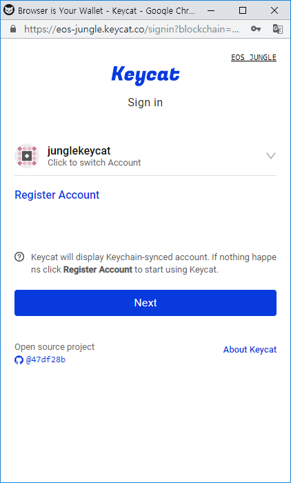

# How-To-Use

## Register

Keycat works by preparing a page for browser to auto-fill `account` and `private key` you saved. If it is your first time using Keycat, You will encounter empty Sign-in Page like below.


Even if you saved your password to browser, sometimes nothing is displayed like above. It is due to browser's security policy to force interaction between page and user. A simple solution is try clicking some empty space.


Let's try to `register` now! Fill-out `Account Name` and `Private Key` of your EOS account. Then you click `Next`. If you entered above information correctly you will be redirected to another page.


Why Browser is asking you to save passwords? Because, it was designed not only for convenient sign-in experience\(you don't have to memorize password\), but also for security reasons. It is hard for us, humans to remember every email-passwords combination. Thus, we tend to use one or two passwords for every websites.

Modern browsers built "Save password" or "Keychain" feature for you to use randomly-generated, very long passwords for each websites. Imagine you are using Twitter or Gmail.


Registering to Keycat is same as using Twitter or Gmail. Your email or username is your EOS account and password is your private key. The only difference is that you have to use "Save password" feature to use Keycat smoothly next time.

Once you save password to browser you are using, Keycat can guide browsers to auto-fill your saved information and use it for signing in or sending transaction.

## Sign in

If you saved your password successfully, let's try signing in and experience awesome Keycat.

When you visit Keycat sign-in page from Dapp, account you registered will be displayed. To remind again, displaying your acccount was possible because browser auto-filled your information. This feature is called "Keychain" and it is used in every Keycat pages.


Your account and private key is stored inside browser. In other words, viewing, managing and deleting this information is not possible in Keycat. Because, browser does not allow websites to directly change or delete saved passwords. The only thing website can do is build a sign in form using specific rules set by browser, and guide browser to auto-fill saved informations.


If you registered multiple accounts, you can switch accounts by clicking displayed account.

## Signing Transaction

This time, we will try to sign transaction with Keycat. In the upper right corner of below picture, you can see key icon. It signals your account information is auto-filled and Keycat is ready to sign transaction on behalf. When you click "Next", payload is signed with your auto-filled private key and sent across network. If account was not auto-filled successfully or payload was wrong formatted by requesting Dapp, It will display failure message. In other cases, Keycat is automatically closed and you successfully sent transaction!

